# Многопоточка VZuev

**Оглавление:**
   
1. [Процесс и поток](#process_and_thread)
2. [Квантование времени выполнения потоков](#kvant_time_execute)
3. [Создание и старт потока](#create_and_start_thread)
4. [Методы sleep() и join()](#sleep_and_join_methods)
5. [Состония потоков](#thread_states)
6. [Прерывание потоков](#thread_stop)
7. [Приоритеты потоков](#priority)
8. [Потоки-демоны](#demon_threads)
9. [Обработчики необрабатываемых исключений](#unchecked_exception_handler)
10. [Фабрика потоков](#thread_factory)
11. [Введение в синхронизацию](#sync_started)
12. [Пример состояния гонок, атоманрные операции](#run_tread_example)
13. [Synchronized. Monitor. Синхронизированные блоки](#sync_monitor)
14. [Wait. Notify](#wait_notify)

### 
1. Процесс и поток

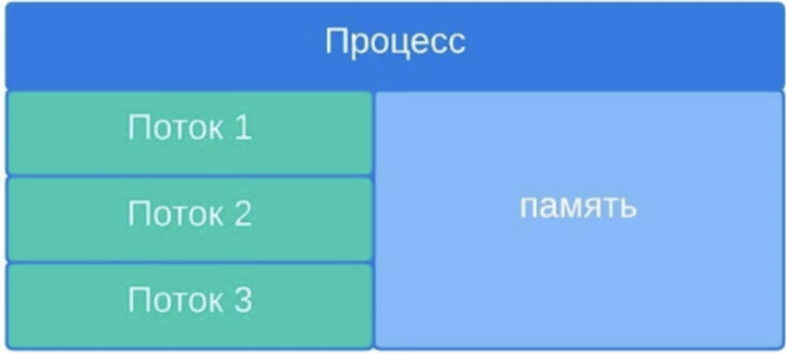
- Процесс - это дорогостоящая операция и для нее ОС выделяет свою мамять под каждый процесс и память этих процессов не пересекается.
- Поток - это более легковесные сущности, которые создаются внутри процессов. Потоки врутри процесса взаимодействуют с одной и 
тойже памятью, которая была выделена процессу

### 
2. Квантование времени выполнения потоков

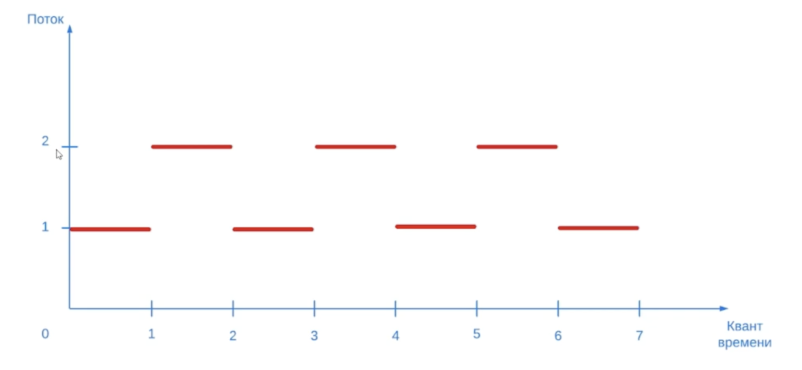
Представим, что у нас одно ядро процессора. 

Тогда проц будет выделять по очереди какой-то квант времени каждому потоку на выполнение. 
Таким образом ядро будто прыгаем межде потоками и выполняет их по немногу
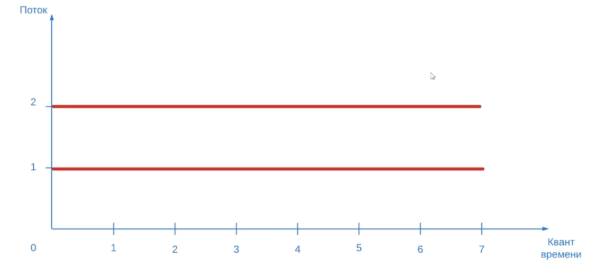
Но если у нас 2 ядра, то они действительно будут выполняться параллельно. Если сбда добавить еще один поток, 
то одно ядро снова начнет прышать между потоками

### 
3. Создание и старт потока

- при старте main() неявно создается поток с именем main
- все последующие потоки отпочковываются от потока main
- Потоки можно создавать своим каким-то классом унаследовавшись от Thread.class. Но если нигде этот класс больше не юзается, 
лучше анонимным классом. Thread наследует функциональный интерфейс Runnable, который содержит в себе метод run()
- для запуска потока юзать start() - thread.start(); Это нужно, чтоб код метода run() запустился в другом потоке

### 
4. Методы sleep() и join()

- Задача: просуммировать числа от одного до 1000. При этом числа от 1 до 500 будет считать один поток, а от 501 до 1000 другой.

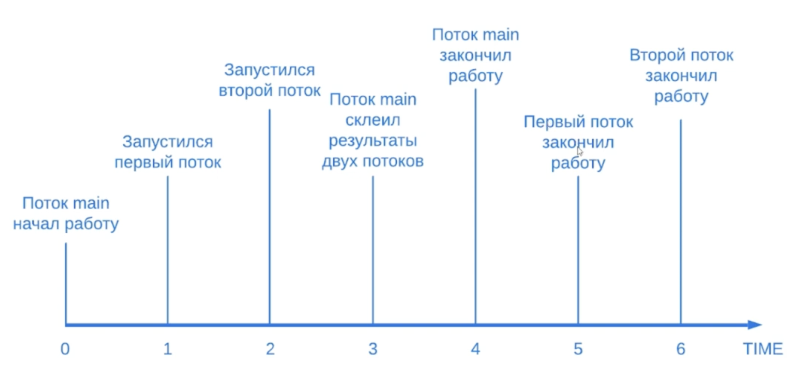
Реализуя код мы получили то, что main закончил выполнение раньше, чем другие потоки и дам над результат НОЛЬ, т.к. 
работы по рассчету шли в других потоках и они не успели посчитать (Runner_4#method_1)

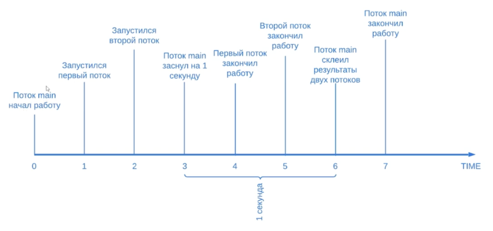
Теперь мы добавили слиппер, который отсановил поток main на 1 секунду, тем самым другие потоки успели выполнить свои расчеты

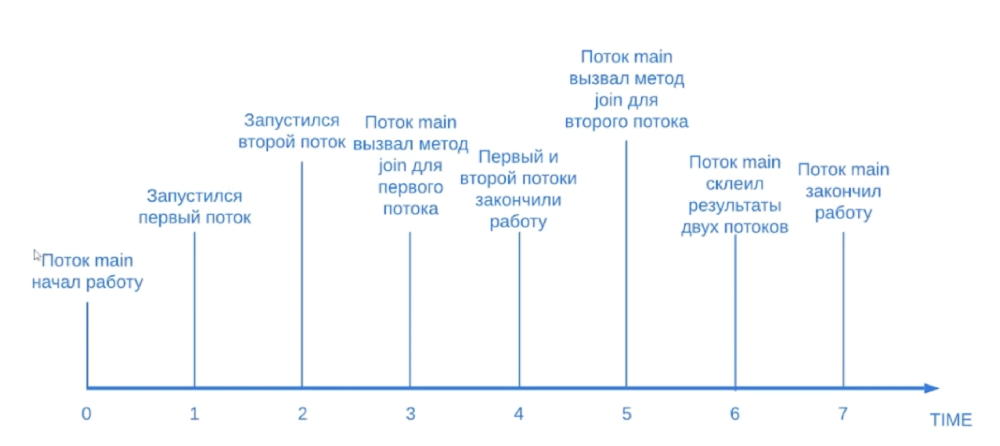
join() останавливает работу текущего потока, пока поток, на котором он был вызван не будет выполнен. 
Т.е. мы ставим thread-0.join() находясь в потоке main и поток main ждет пока не будут выполнены все потоки, которые были 
вызваны на нем с .join
Перегруженный метод join(timeout) - тут мы укажем максимальное количество милисекунд, сколько мы согласны ждать.

### 
5. Состония потоков

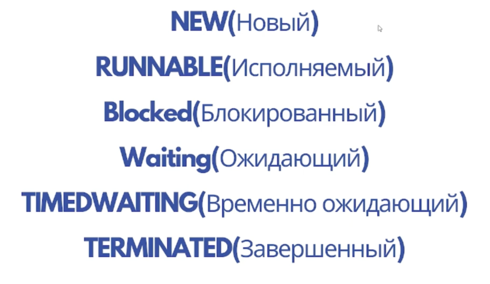
Сотояния потоков определеятся енамом State, который лежит в Thread. Получить состояние потока можно вызвав getState() на потоке

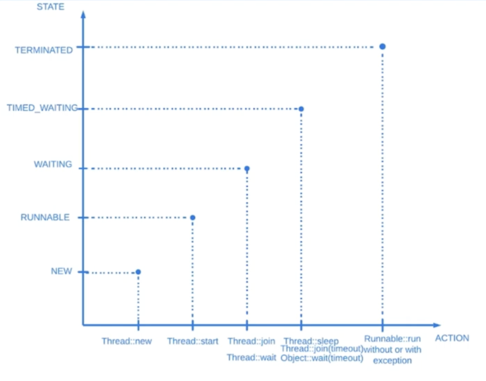
- NEW - состояние потока, который уже создан через new но еще не был запущен
- RUNNABLE - состояение потока, который был запущен методом start() и выполняется сейчас
- BLOCKED - рассмотрим позже, когда будем говорить о мониторах/блокировках
- WAITING - На этом занятии мы будем его делать при помощи join() - какой-то поток будет ждать выполнения другого
но можно еще Thread.wait() от Object
- TIMED_WAITING - можно при помощи sleep(), join(timeout), тот же wait(timeout)
- TERMINATED - если поток завершил свою работу - run() просто все сделал либо из-за необработанного исключения выброшенного 
из метода run(), которое тож прекратит работу потока. Нужно обратить внимание: что если исключение убъет какой-то поток, другие 
продолжат работать!

### 
6. Прерывание потоков

Поток можно прервать, если это нужно
thread.stop() - прервет выполнение потока. Но этот метод deprecated, т.к. нельзя просто так взять и прибить каким-то
потоком другой поток. Но мы можем попросить какой-то поток завершится.
thread.interrupt() - выставит значение isInterrupted для целевого потока в true. Затем выполняя проверку на целевом
потоке по свойству isInterrupted() можно писать логику, чтоб он завершал свою работу. 

Например:

     final Thread communicatingThread = new Thread(() -> {
            try {
                while (!Thread.currentThread().isInterrupted()) {
                    doRequest();
                }

            } catch (InterruptedException e) {
                throw new RuntimeException(e);
            }
        });

    Этот код выполняется до тех пор, пока из другого потока, ему не изменят свойство isInterrupted() вызвав на 
    этом потоке communicatingThread.interrupt();

Не всегда можно запросить на потоке свойство isInterrupted(), т.к. поток может быть заблокирован, например, 
обрабатывает запрос или тот самый метод sleep(). Тут и приходит на помощь исключение InterruptedException - 
блокирующие вызовы прерываются при его помощи.

Представим, что мы отлавливаем это исключение и продолжаем работу потока. Тогда как нам узнать, что поток был прерван?
Thread.interrupted() - проверяет, был ли прерван текущий поток. Более того, вызов этого метода приводит, что это 
свойство устанавливается в false
а вот
Thread.isInterrupted() - можно использовать просто для проверки, был ли прерван текущий поток и поле он не изменяет

Так как правильно обрабатывать отловленное исключение InterruptedException? Т.к. извне мы не сможем узнать, был ли
поток прерван, т.к. мы отловили исключение. И по запросу isInterrupted() мы получим false.
Просто в блоке catch нужно руками проставить это свойство на потоке - currentThread.interrupt() - выставит поле в true

     final Thread communicatingThread = new Thread(() -> {
            while (true) {
                try {
                    doRequest();
                } catch (InterruptedException e) {
                    Thread.currentThread().interrupt();
                    System.out.println(Thread.currentThread().isInterrupted());
                    System.out.println(THREAD_WAS_INTERRUPTED);
                }
            }
        });

### 
7. Приоритеты потоков

- Если много потоков будет находится в состоянии ожидания, то планировцик потоков запустит поток с бОльшим приоритетом. 
Представим что есть много потоков с высоким приоритетом и несколько с маленьким. Может выйти так, что потоки с малым приоритетом 
никогда не будут запущены. Лучшей практикой считается использовать приоритеты по умолчанию и не изменять их. 
Приоритет потоков это числа от 1(min) до 10(max) или универсальными константами из класса Thread:
- > MIN_PRIORITY
- > NORM_PRIORITY 
- > MAX_PRIORITY
  
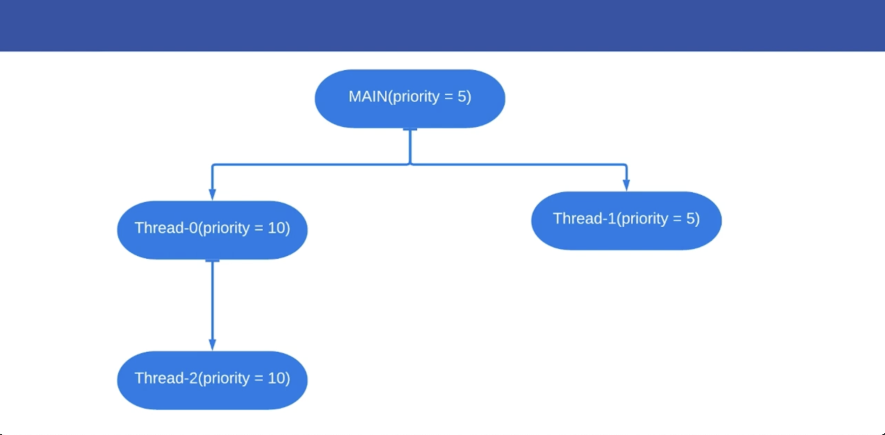
Обычный приоритет это приоритет - 5. По умолчанию, поток наследует приоритетет потока от которого он был создан.
Напомню, что при запуске программы у нас неявно создался поток main с дефолтным приоритетом 5. 
- от main мы отпочковали поток_0 и изменили ему приоритет на 10. От поток_0 отпочковали поток_2 и 2й получил приоритет родителя.
Отпочковали от main поток_1 который получил от родителя приоритет 5.
- Если создать поток с приоритетом меньше 1 или больше 10 - IllegalArgException

На самом деле не стоит пытаться манипулировать приоритетами потоков, т.к. это все непредсказуемо и зависит от многих факторов. 
Поэтому нужно просто юзать потоки с дефолтным приоритетом - 5

### 
8. Потоки-демоны

Потоки-демоны - это потоки, которые выполняются в фоне. 
Программа завершится, если все потоки-НЕдемоны закончат свою работу. Т.е. если были какие-то потоки демоны и они 
все еще работают, когда все НЕдемоны завершатся, программа остановится. 
Главный поток main неДемон, и в этом можно убедиться вызвав метод 

    Thread.currentThread().isDaemon()

Чтобы сделать какой-то поток, потоком-демоном, нужно перед стартом установить это значение - thread.setDaemon(true):

    Thread thread = new Thread(new Task());
    thread.setDaemon(true);

Новый поток: как и приоритет, наследует демон статус потока. Если демон создал поток, то это будет поток демон

Потоки демоны нужно юзать осторожно, помня, что он может быть прекрашен в любой момент времени - будь то запрос в бд, 
чтение файла или даже блок finally

### 
9. Обработчики необрабатываемых исключений

Метод run() не может гененрировать никаких обрабатываемых исключений, но может быть прерван сам непроверяемым исключением 
Как только в методе run() возникает исключение, поток уничтожается. но прежде чем поток будет уничтожен, исключение 
передается обработчику необрабатываемых исключений. Для Написания такого обработчика, нам нужно написать свой класс 
реализующий Thread.UncaughtExceptionHandler. Этот обработчик можно установить в любой поток. Кроме того, можно назначить 
какой-то обработчик дефолтным для всех потоков

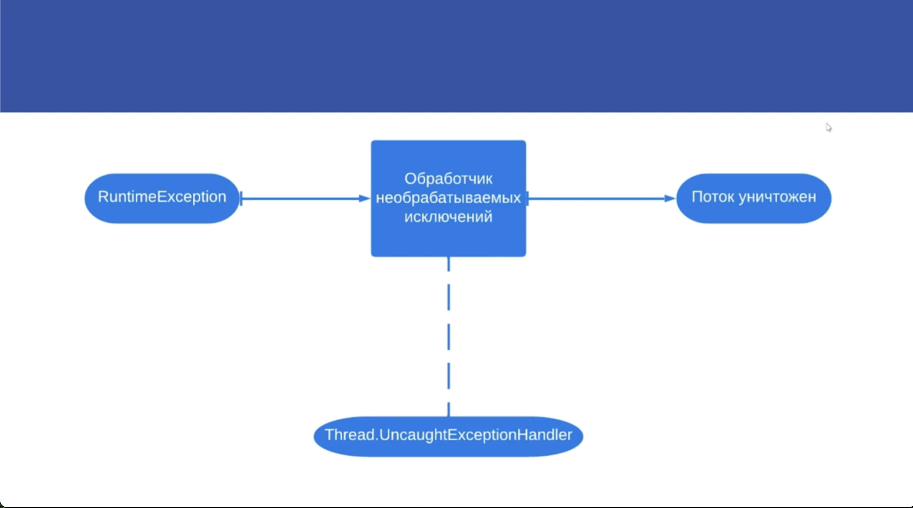

На самом деле UncaughtExceptionHandler это функциональный интерфейс, а значит класс можно не создавать и юзать лямбдой.

### 
10. Фабрика потоков

Представим, что нужно создавать некоторое количество потоков с одинаковыми настройками. Для этого сгодится фабрика. 
Для этого подойдет интерфейс ThreadFactory. Он принимает Runnable и возвращает Thread

### 
11. Введение в синхронизацию

У каждого процесса есть своя памят и свои потоки. Потоки внутри процесса обращаются к одной памяти. Это ведет к тому, 
что два потока, могу одновременно обращаться к одним и тем же данным, что может привести к проблемам

Что хранится в Stack
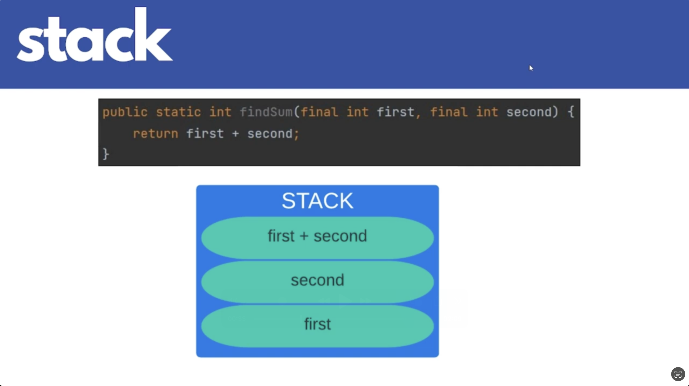

Что хранится в Heap
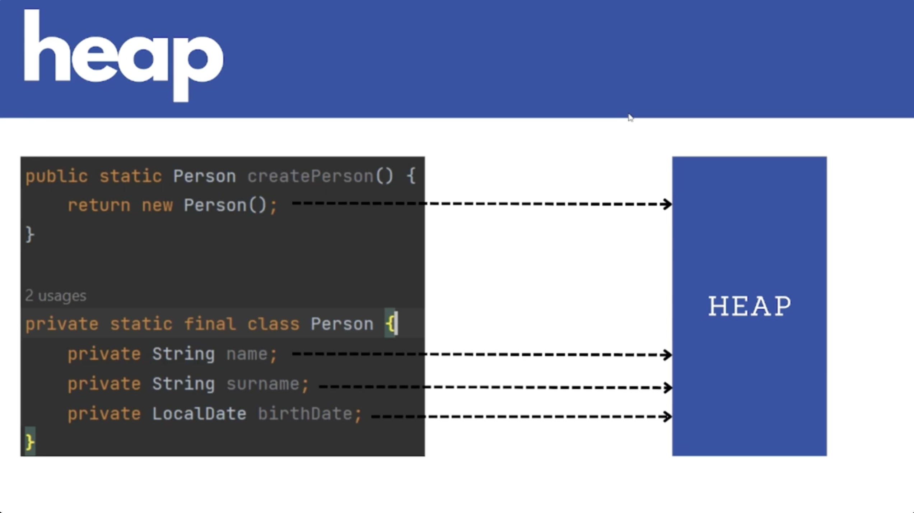

Так вот у каждого потока СВОЙ stack но ОБЩАЯ куча
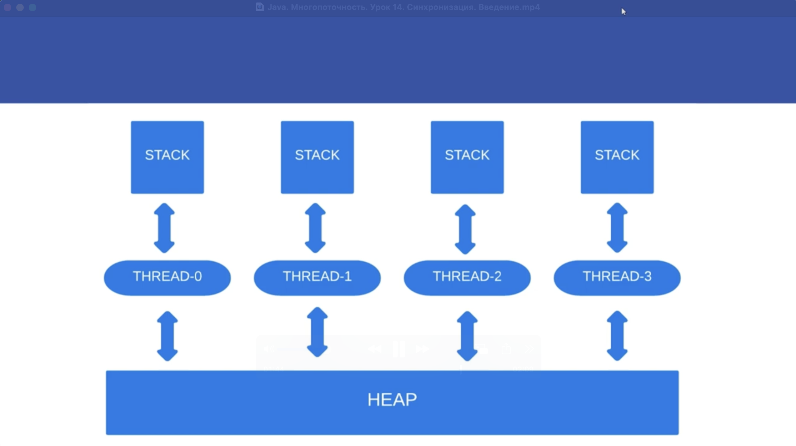

Что бы избежать того, что потоки обращаясь к одним и тем же данным потенциально генерили бы проблемы, нам нужно это 
решать при помощи синхронизации

### 
12. Пример состояния гонок, атоманрные операции

В потоках не может быть прервана никакая атомарная операция. Такая операция либо еще не начинала выполняться, либо 
уже закончилось ее выполнение. 

Атомарная операция в Java это:
- опрация присваивания примитивным типа, кроме long и double
- присваивание ссылок

На скрине мы видим опрации выполняемые в одном потоке. Мы видим, что операция A и С атомарные, и не могут быть прерваны. 
А опрерация B неАтомарная и она может быть прервана на любом из ее этапов
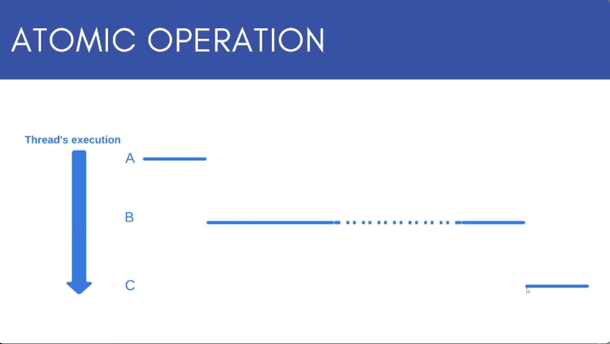

Вот как выглядит операция counter++, когда мы в коде пытались разными потоками инкрементировать переменную
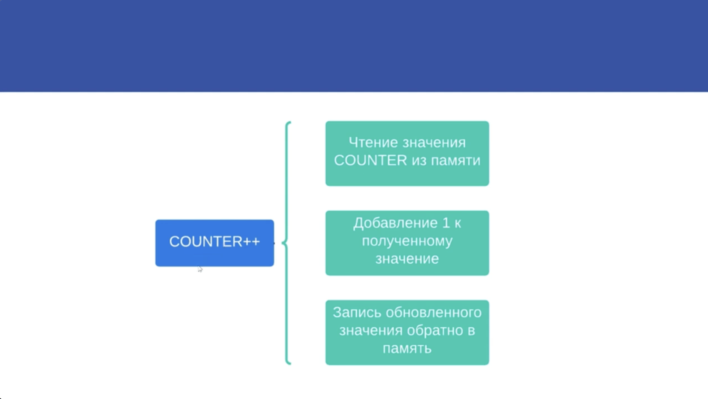

- Сначала мы прочли переменную
- Затем увеличили ее на 1
- записали новое значение в переменную

Легко догадаться, что другой поток между этими этапами вклинился своим выполнением. Тогда получилось так, что 
поток_1 успел прочесть переменную, увеличить ее на 1 и остановился. Второй поток успел прочитать, увеличить и записать, 
затем остановился. Первому потоку не известно, что переменную уже увеличивали и он законно просто доделал свою 
операцию записав свой результат. Таким образом одна операция инкремента была потеряна.
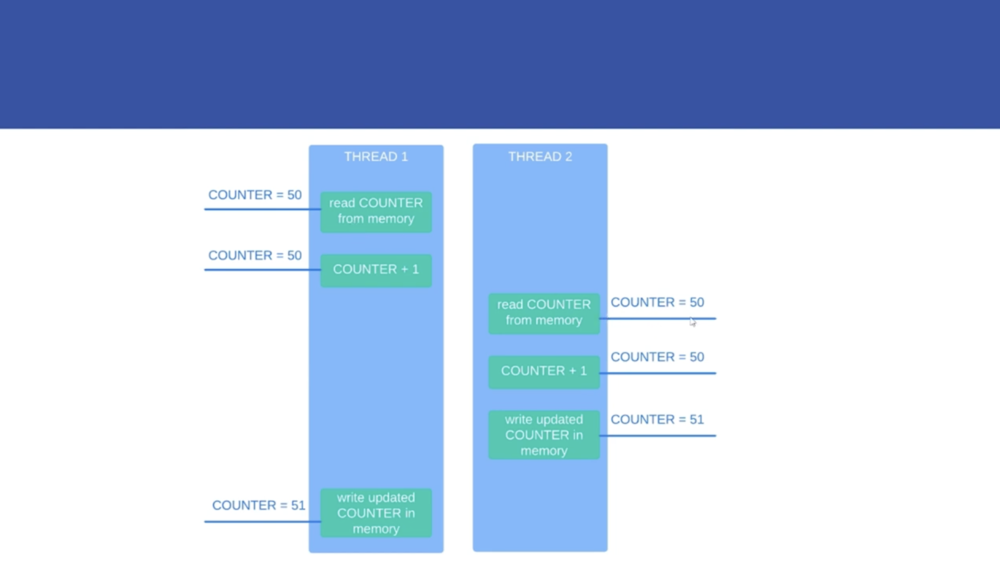

Решаем эту задачу, вынеся count++ в синхронизированный метод. Теперь никакой поток не может прервать операцию counter++

    private static synchronized void increment() {
        counter++;
    }

### 
13. Synchronized. Monitor. Синхронизированные блоки

Разберемся, что происходит под капотом, когда мы юзаем synchronized.

Monitor - каждый объект в java обладает монитором. И у каждого объекта есть только один монитор.
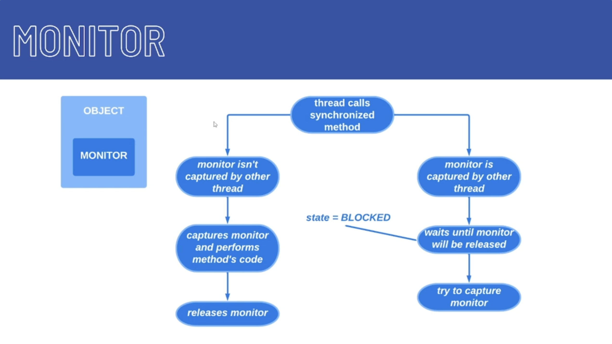
Когда, какой-то поток пытается вызвать синхронизированный метод, он сначала проверяет, был ли захвачен этот монитор 
каким-то другим потоком. 

Если монитор захвачен, поток останавливается и находится в стотоянии BLOCKED и ждет, пока монитор 
освободится. Когда монитор освобождается поток конкурирует за монитор с другими потоками, которой тоже пытаются его 
захватить.

Если монитор не был захвачен, то наш поток его захватывает и начинает выполнять код в его методе.
Когда закончит работу поток освободит монитор

Захватывая какой-то статичный метод, поток захватывает монитор целого класса

тут надо ХОРОШО запомнить, что если в классе есть несколько статических методов, то монитор захватывается класса целиком 
и никто не может больше в этом классе ничего юзать - это далеко не всегда нужно

На самом деле монитор можно захватывать по любому классу. 
Для примера перепишем наш sync-метод в sync-блок и это будет работать так же, как и было с sync-методом до этого

    private static void incrementFirstCounter() {
        synchronized(Runner_17_syncMonitor.class) {
            firstCounter++;
        }
    }

В данном случае мы будем синхронизироваться по объекту Runner_17_syncMonitor.class

Означает ли это, что мы можем синхронизироваться вообще по любому объекту в Java? 
Да. Мы можем создать любой объект и синхронизироваться по нему

    private static final Object LOCK_TO_INCREMENT_FIRST_COUNTER = new Object();

    private static void incrementFirstCounter() {
        synchronized (LOCK_TO_INCREMENT_FIRST_COUNTER) {
            firstCounter++;
        }
    }

Тетепрь у нас нет синхронизированного метода, который захватил бы монитор всего класса, но есть 
синхронизированный блок с монитором стороннего объекта. Этот блок синхронизирован именно по этому объекту,
а это значит, что если монитор именно этого объекта захвачен, то другим потоком и будет проверяться этот монитор

НЕстатический синхронизированный метод синхронизируется по объекту this
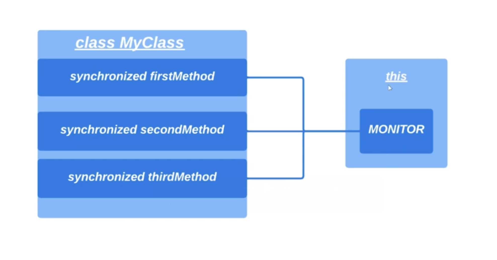

### 
14. Wait. Notify

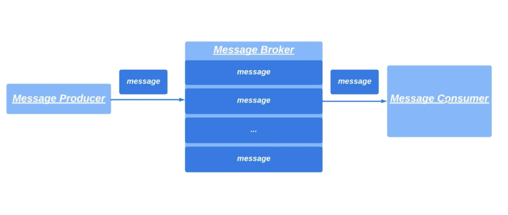
Представим задачу, что у нас есть некий MessageBroker, который хранит в себе сообщения. Есть producer, который 
эти сообщения жоставляет и есть consumer, который эти сообщения потребляет и удаляет те, которые он уже принял.
Максимальное количество сообщений в брокере - 5

Представим, как бы мы это реализовали:
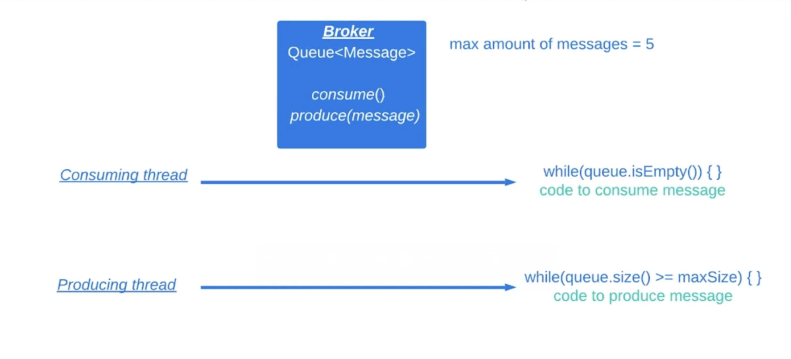

Есть 2 потока, один записывает, другой считывает. В Брокере есть очередь с которой работают оба потока, и значит 
мы будем синхронизировать работу с ней -> т.е. будем синхронизироваться по монитору объекта класса брокера.

см. Runner_18_waitNotify.class

При первом запуске в консоле мы видим:
        
    Message 'null' is consumed
    Message 'multithread.vzuev.lessons.run18_MessageBroker.model.Message[data = Message#1]' is produced
    Message 'multithread.vzuev.lessons.run18_MessageBroker.model.Message[data = Message#1]' is consumed
    Message 'multithread.vzuev.lessons.run18_MessageBroker.model.Message[data = Message#2]' is produced
    Message 'multithread.vzuev.lessons.run18_MessageBroker.model.Message[data = Message#2]' is consumed
    ...

Потребитель отработал раньше продюсера, поэтому певое сообщение null, а дальше все штатно.

Какие мы тут видим проблемы:
1. Если консьюмер будет работать интенсивнее продюсера, то мы будем в консьюмере получать много null
   (реализуем подкинув в продюсер слипеер больше, чем в консьюмер)

        Message 'null' is consumed
        Message 'null' is consumed
        Message 'multithread.vzuev.lessons.run18_MessageBroker.model.Message[data = Message#1]' is produced
        Message 'multithread.vzuev.lessons.run18_MessageBroker.model.Message[data = Message#1]' is consumed
        Message 'null' is consumed
        Message 'null' is consumed

2. Если продюсер будет работать интенсивнее, то мы переполним очередь, а у нас по условию должно быть
   не более 5 сообщений (реализуем как с консьюмером)

        Message 'multithread.vzuev.lessons.run18_MessageBroker.model.Message[data = Message#1]' is produced
        Message 'multithread.vzuev.lessons.run18_MessageBroker.model.Message[data = Message#2]' is produced
        Message 'multithread.vzuev.lessons.run18_MessageBroker.model.Message[data = Message#1]' is consumed
        Message 'multithread.vzuev.lessons.run18_MessageBroker.model.Message[data = Message#3]' is produced
        Message 'multithread.vzuev.lessons.run18_MessageBroker.model.Message[data = Message#4]' is produced
        Message 'multithread.vzuev.lessons.run18_MessageBroker.model.Message[data = Message#5]' is produced
        Message 'multithread.vzuev.lessons.run18_MessageBroker.model.Message[data = Message#2]' is consumed
        Message 'multithread.vzuev.lessons.run18_MessageBroker.model.Message[data = Message#6]' is produced
        Message 'multithread.vzuev.lessons.run18_MessageBroker.model.Message[data = Message#7]' is produced
        Message 'multithread.vzuev.lessons.run18_MessageBroker.model.Message[data = Message#8]' is produced

Пробуем решать проблемы:
Поставим условие проверять наличие сообщений и только тогда их читать:

        public synchronized Message consume() {
            while (messages.isEmpty()) {
            }
            return messages.poll();
        }

  Висим в бесконечном цикле, пока сообщения не появятся.
  
  Запуск приложения показал, что консоль пуста. Все потому, что монитор был захвачен консьюмером и он держит 
  монитор объекта брокера, не давая продюсеру положить сообщение. Получили одну из разновидностей deadlocks.
  
  Тот же deadlock мы получим, если сделаем наоборот для продюсера. Поставим условие, чтоб он писал сообщения только 
  тогда, когда сообщений меньше 5. Пяти продюсер захватит монитор, положит пять сообщений и будет держать монитор 
  до тех пор, пока консьюмер не заберет хотя бы одно сообщение, но этого не произойдет
  
        public synchronized void produce(Message message) {
        while (messages.size() >= maxStoredMessages) {}
        messages.add(message);
    }

тогда в консоле поулчаем:

    Message 'multithread.vzuev.lessons.run18_MessageBroker.model.Message[data = Message#1]' is produced
    Message 'multithread.vzuev.lessons.run18_MessageBroker.model.Message[data = Message#2]' is produced
    Message 'multithread.vzuev.lessons.run18_MessageBroker.model.Message[data = Message#1]' is consumed
    Message 'multithread.vzuev.lessons.run18_MessageBroker.model.Message[data = Message#3]' is produced
    Message 'multithread.vzuev.lessons.run18_MessageBroker.model.Message[data = Message#4]' is produced
    Message 'multithread.vzuev.lessons.run18_MessageBroker.model.Message[data = Message#5]' is produced
    Message 'multithread.vzuev.lessons.run18_MessageBroker.model.Message[data = Message#2]' is consumed
    Message 'multithread.vzuev.lessons.run18_MessageBroker.model.Message[data = Message#6]' is produced
    Message 'multithread.vzuev.lessons.run18_MessageBroker.model.Message[data = Message#7]' is produced

    Видим, что консьюмер какое-то время успевал забирать сообщения, но вскоре продюсер увидел, что в 
    очереди уже 5 сообщений и повис на своем while и держит монитор

Решить мы это можем использую wait() и notify() которые:
Консьмер провряет есть ли сообщения в очереди, если их нет, то он освобождает монитор (wait) - поток будто говорит, 
что я тут сделал все что мог и перехоху в ожидание, но при этом я хочу разрешить других синхронизированных операций 
по этому монитору. И только после вызова другим потоком метода notify() поток на вейте получает уведомление о том, 
что ожидающий поток после освобождения монитора может конкурировать с другими потоками за захват монитора
объекта и попытаться продолжить работу с того места, где он вызвал метод wait().

wait() и notify() может вызываться ТОЛЬКО внутри sync методом и блоков иначе получим IllegalMonitorStateException

после вызова notify() может быть сколько угодно кода.

Усложним задачу и продолжим в Runner_19_practice

Будет при продюсера и три консьюмера. Размер очереди 15
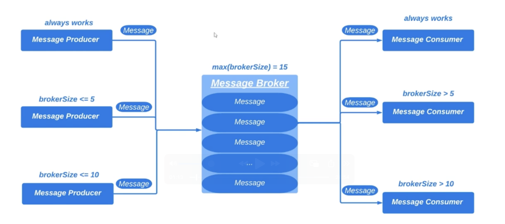

- Если в брокере от 0 до 5 сообщений - работает 3 брокера и 1 консьюмер
- от 6 до 10 включительно - 2 брокера и 2 консьюмера
- от 10 до 15 - 1 брокер 3 консьюмера
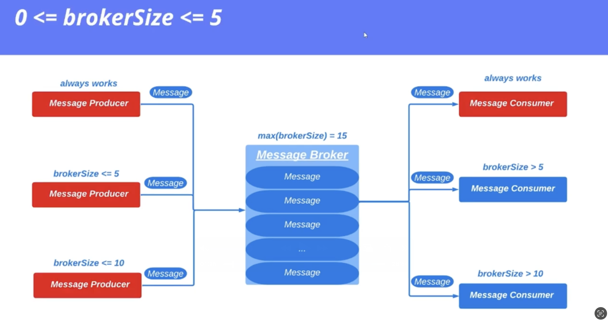

Изменим нашу задачу. У нас будет 2 продюсера и 1 консьюмер. Так же мы в тасках уберем слипперы. Сообщений в очереди = 1
См. Runner_20_waitNotifyNotifyAll

Запуск программы показал, что в какой-то момент программа остановилась.

      Message 'Message[data = Message#1]' is produced by producer 'PRODUCER_1'. Amount of messages before producing: 0
      Message 'Message[data = Message#1]' is consumed by consumer 'CONSUMER_1'. Amount of messages before consuming: 1
      Message 'Message[data = Message#3]' is produced by producer 'PRODUCER_1'. Amount of messages before producing: 0
      Message 'Message[data = Message#3]' is consumed by consumer 'CONSUMER_1'. Amount of messages before consuming: 1
      Message 'Message[data = Message#2]' is produced by producer 'PRODUCER_2'. Amount of messages before producing: 0

Разберем что произошло:
- Пусть сначала монитор захватил консьюмер. Он увидел, что очередь сообщений пуста и вызвал на объекте брокера wait().
Теперь консьюмер ждет, пока другой поток на мониторе объекта брокера вызовет метод notify().
- Пусть теперь монитор захватил продюсер1. Он увидел, что очередь пуста, положил туда сообщение и вызвал notify().
notify() разбудит любой 1 рандомный поток, который находится в wait на этом мониторе. В данном случае это один единственный 
консьюмер. Консьюмер - получает notify и захватывает монитор.
- Консьюмер видит, что сообщение есть, обрабатывает его и освобождает монитор. wait() консьюмер не вызывал.
- Пусть теперь монитор захватил снова продюсер1. Он увидел, что очередь пуста и положил туда сообщение. Снова вызвал 
notify()
- notify() никто сейчас не ждет
- Пусть теперь монитор захватил продюсер2. Он увидел что в очереди уже есть ссобщение и вызвал wait()
- Пусть теперь монитор захватил продюсер1. Он увидел что в очереди уже есть ссобщение и вызвал wait()
- Теперь монитор захватил консьюмер1. Он увидил сообщение, обработал его и вызвал notify(). Напомним, что notify() 
разбудит рандомный поток из тех, что вызвал wait() на этом мониторе
- Пусть из-за notify() проснулся продюсер1
- ВАЖНО!! Хз, как, (возможно после notify() было достаточно много времени, чтоб консьюмер успел) но тут консьюмер 
успел снова захватить монитор. Увидел, что сообщений нет и вызвал wait()
- монитор захватывает продюсер1, сообщений нет - кладет и вызывает notify()
- проснулся продюсер2 - увидел что сообщения есть и вызвал wait()
- монитор снова захватывает продюсер1 (он и не спал) - видит что сообщения есть и вызывает wait()
- На этом этапе у нас все потоки вызвали wait и находятся в waiting. Вызвать для них notify() и разбудить их некому.

Хорошо бы, когда продюсер1 работал, а продюсер2 и консьюмер находились в waiting продюсером1 стопроцентно разбудить 
консьюмер, а не полагаться на удачу того, что notify() разбудит именно консьюмер, а не срандомит на продюсер.
- notifyAll() - разбудит ВСЕ потоки, кто на мониторе вызывал wait()